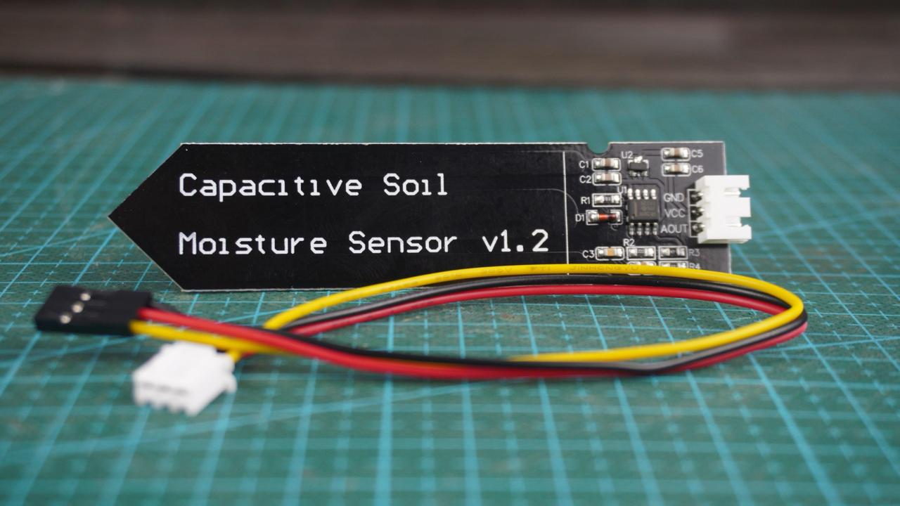
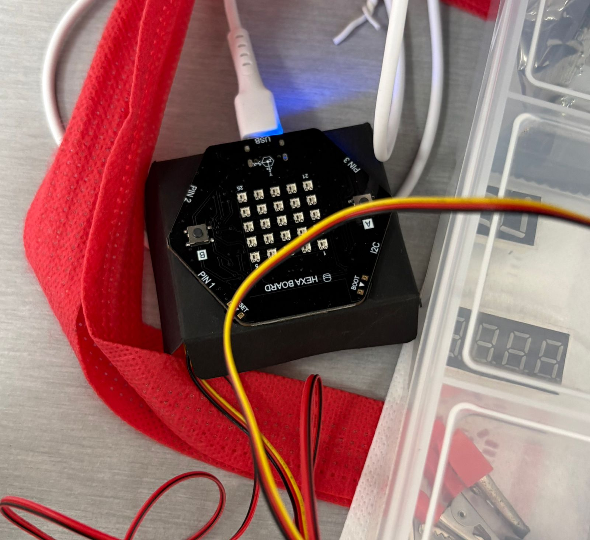
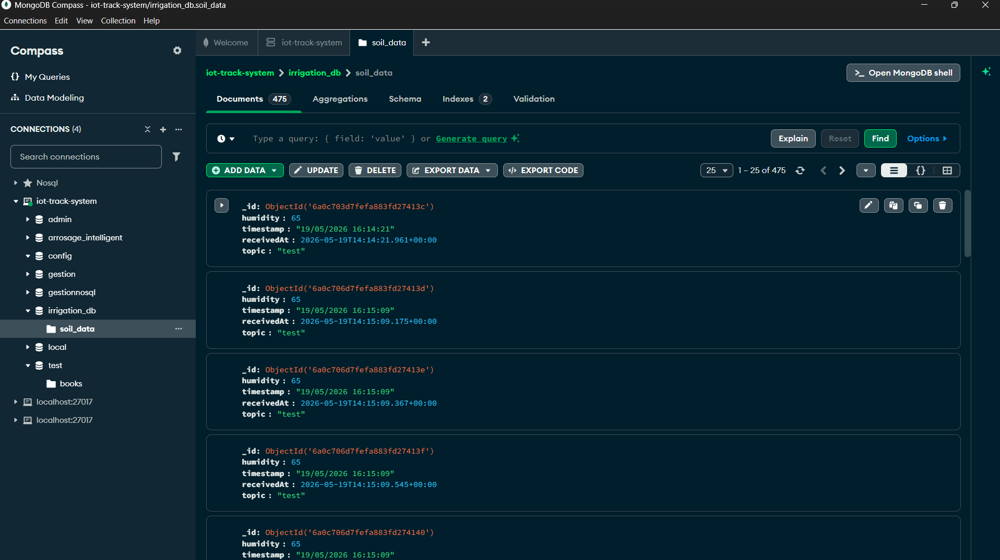
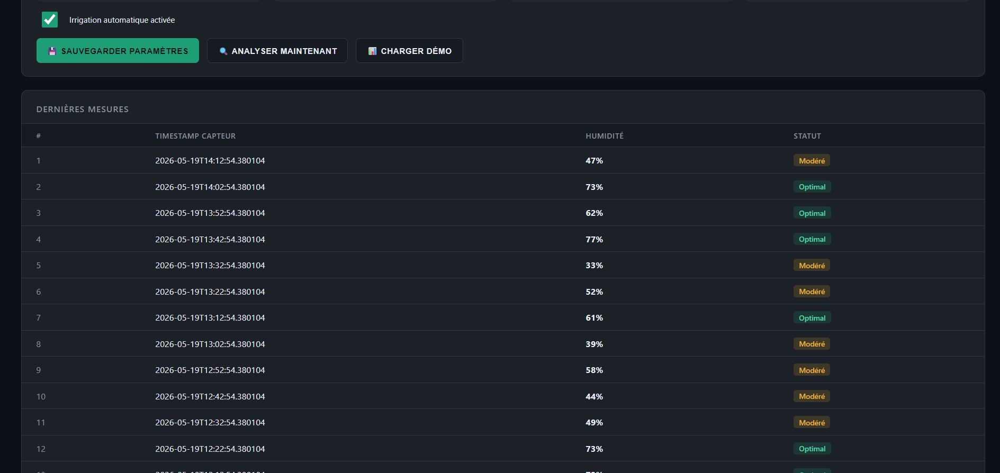
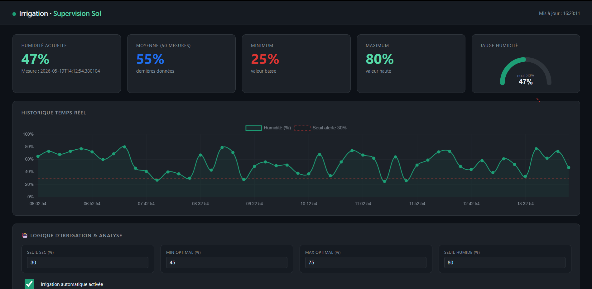

# Smart Irrigation System

Système de supervision et gestion d'irrigation basé sur l'humidité du sol, fournissant une interface de monitoring en temps réel, une base de données persistante avec MongoDB, et une API REST pour l'intégration.

## 🎬 Démonstration

Voici une démonstration complète du système en action :


**Ci-dessus** : Interface de monitoring en temps réel affichant l'humidité actuelle, l'historique graphique, les statistiques et les recommandations d'irrigation automatisées.

---

## Aperçu

Ce système permet de :

- Monitorer l'humidité du sol en temps réel
- Configurer des seuils d'irrigation personnalisés
- Obtenir des recommandations automatisées d'irrigation
- Conserver un historique complet des mesures
- Intégrer des capteurs ou systèmes externes via API REST

## Fonctionnalités

- **Supervision en temps réel** : Affichage de l'humidité actuelle, moyenne, minimum et maximum
- **Historique graphique** : Visualisation des 50 dernières mesures avec Chart.js
- **Logique d'irrigation configurable** : Seuils adaptables selon les besoins (SEC, OPTIMAL, HUMIDE)
- **Analyse intelligente** : Recommandations automatiques basées sur les paramètres
- **Persistance MongoDB** : Stockage durable des logs avec TTL (7 jours)
- **API REST complète** : Endpoints pour toutes les opérations (lecture, écriture, analyse)
- **Interface responsive** : Design moderne adapté à tous les écrans

## Composants du Système

### 1. Capteur d'Humidité



**Rôle** : Le capteur d'humidité mesure le niveau d'eau dans le sol en temps réel. C'est le cœur du système qui communique avec la carte BBC Microbit pour transmettre les données au serveur central.

### 2. Pompe d'Irrigation


**Rôle** : La pompe d'irrigation est l'actionneur du système. Elle reçoit les commandes de contrôle du serveur et active ou désactive l'irrigation en fonction des recommandations du système d'analyse basé sur les seuils configurés.

### 3. Carte BBC Microbit



**Rôle** : La carte BBC Microbit est le microcontrôleur embarqué qui gère l'acquisition des données du capteur, le contrôle de la pompe et la communication réseau avec le serveur API. Elle constitue le cerveau du système IoT côté matériel.

### 4. Base de Données MongoDB



**Rôle** : MongoDB stocke de manière persistante tous les enregistrements d'humidité avec timestamps, les paramètres de logique d'irrigation configurés et les historiques. Les données expirent automatiquement après 7 jours pour optimiser l'espace disque.

### 5. Interface de Logs et Historique



**Rôle** : Affiche l'historique complet de toutes les mesures enregistrées, les timestamps précis, les sources de données et permet de consulter les patterns d'humidité pour une meilleure compréhension du comportement du système.

### 6. Gestion des Dates et Timestamps



**Rôle** : Gère tous les timestamps en format ISO 8601 pour garantir une traçabilité précise de chaque événement dans le système. Essentiel pour l'analyse temporelle et la recherche d'historique par date.

---

## Architecture

```
smart-irrigation-system/
├── index.html                 # Interface web (HTML5/CSS3/JavaScript)
├── start.bat                  # Script de démarrage (Windows)
├── README.md                  # Documentation
├── assets/                    # Ressources (images, GIF)
│   ├── detecteur.jpeg         # Photo du capteur
│   ├── pompe.jpeg             # Photo de la pompe
│   ├── BBC_microbit.png       # Image de la carte
│   ├── mongodb.png            # Logo MongoDB
│   ├── logs.png               # Interface des logs
│   ├── date.png               # Gestion des timestamps
│   └── gif-demo.gif           # Démonstration animée
│
└── backend/
    ├── app.py                 # API Flask
    ├── requirements.txt       # Dépendances Python
    └── .env                   # Configuration
```

## Prérequis

- Python 3.8 ou supérieur
- MongoDB Community Edition 4.0+
- Navigateur moderne (Chrome, Firefox, Safari, Edge)

## Installation

### 1. Installer les dépendances système

**Windows :**

```bash
# Installer Python depuis https://www.python.org/downloads/
# Installer MongoDB depuis https://www.mongodb.com/try/download/community
```

**macOS :**

```bash
brew install python@3.11
brew install mongodb-community
```

**Linux (Ubuntu/Debian) :**

```bash
sudo apt-get update
sudo apt-get install -y python3.11 python3-pip
sudo apt-get install -y mongodb
```

### 2. Configurer le projet

```bash
cd smart-irrigation-system
cd backend
pip install -r requirements.txt
```

### 3. Configurer MongoDB (optionnel)

Éditer `backend/.env` :

```
MONGO_URI=mongodb://localhost:27017
DB_NAME=arrosage_intelligent
```

### 4. Démarrer le système

**Windows :**
Double-cliquer sur `start.bat`

**macOS / Linux :**

```bash
cd backend
python app.py
```

Le serveur démarre sur `http://localhost:5000`

### 5. Accéder à l'interface

Ouvrir `index.html` dans un navigateur (ou `file:///chemin/vers/index.html`)

## Utilisation

### Via l'interface web

1. **Charger données de démonstration** : Cliquer sur "Charger démo" pour peupler la base
2. **Configurer les seuils** : Modifier les valeurs d'humidité selon vos besoins
3. **Analyser la situation** : Cliquer "Analyser maintenant" pour obtenir une recommandation
4. **Consulter l'historique** : Observer le tableau des dernières mesures

### Via l'API REST

#### Récupérer la dernière mesure

```bash
curl http://localhost:5000/api/latest
```

Réponse :

```json
{
  "humidity": 65,
  "timestamp": "2026-05-19T14:30:00Z",
  "source": "sensor_01"
}
```

#### Ajouter une nouvelle mesure

```bash
curl -X POST http://localhost:5000/api/readings \
  -H "Content-Type: application/json" \
  -d '{
    "humidity": 65,
    "source": "sensor_01"
  }'
```

#### Ajouter plusieurs mesures

```bash
curl -X POST http://localhost:5000/api/readings/bulk \
  -H "Content-Type: application/json" \
  -d '[
    {"humidity": 45},
    {"humidity": 52},
    {"humidity": 48}
  ]'
```

#### Récupérer les statistiques

```bash
curl http://localhost:5000/api/stats
```

Réponse :

```json
{
  "avg": 55,
  "min": 25,
  "max": 80
}
```

#### Obtenir une analyse et recommandation

```bash
curl http://localhost:5000/api/analyze
```

Réponse :

```json
{
  "current_humidity": 26,
  "status": "ALERTE_SECHERESSE",
  "recommendation": "Irrigation immédiate recommandée",
  "urgency": "CRITIQUE",
  "thresholds": {
    "dry": 30,
    "optimal_min": 45,
    "optimal_max": 75,
    "wet": 80
  },
  "timestamp": "2026-05-19T14:30:00.000Z"
}
```

## Endpoints API

### Lectures

| Méthode | Endpoint       | Description                      |
| ------- | -------------- | -------------------------------- |
| GET     | `/api/latest`  | Dernière mesure enregistrée      |
| GET     | `/api/history` | 50 dernières mesures             |
| GET     | `/api/stats`   | Statistiques (moyenne, min, max) |

### Écriture

| Méthode | Endpoint             | Description               |
| ------- | -------------------- | ------------------------- |
| POST    | `/api/readings`      | Ajouter une mesure        |
| POST    | `/api/readings/bulk` | Ajouter plusieurs mesures |

### Logique et Analyse

| Méthode | Endpoint       | Description                            |
| ------- | -------------- | -------------------------------------- |
| GET     | `/api/logic`   | Récupérer les paramètres d'irrigation  |
| PUT     | `/api/logic`   | Mettre à jour les paramètres           |
| GET     | `/api/analyze` | Analyser et obtenir une recommandation |

### Utilitaires

| Méthode | Endpoint         | Description                      |
| ------- | ---------------- | -------------------------------- |
| GET     | `/api/health`    | Vérifier la santé du système     |
| POST    | `/api/demo/seed` | Charger données de démonstration |

## Configuration des seuils

Les paramètres d'irrigation peuvent être personnalisés :

| Paramètre         | Valeur par défaut | Description                            |
| ----------------- | ----------------- | -------------------------------------- |
| `dry_threshold`   | 30%               | Seuil d'alerte sécheresse              |
| `optimal_min`     | 45%               | Humidité minimale recommandée          |
| `optimal_max`     | 75%               | Humidité maximale recommandée          |
| `wet_threshold`   | 80%               | Seuil d'humidité excessive             |
| `auto_irrigation` | true              | Activation de l'irrigation automatique |

## Recommandations d'irrigation

| Humidité | Statut            | Recommandation            | Urgence  |
| -------- | ----------------- | ------------------------- | -------- |
| < 30%    | ALERTE_SECHERESSE | Irrigation immédiate      | CRITIQUE |
| 30-45%   | SEC               | Irrigation recommandée    | HAUTE    |
| 45-75%   | OPTIMAL           | Aucune action             | BASSE    |
| 75-80%   | HUMIDE            | Attendre avant irrigation | BASSE    |
| > 80%    | TRÈS_HUMIDE       | Trop d'eau - vérifier     | MOYENNE  |

## Base de données

MongoDB contient deux collections :

### Collection `readings`

Enregistre chaque mesure d'humidité :

```json
{
  "_id": ObjectId,
  "humidity": 65,
  "timestamp": "2026-05-19T14:30:00Z",
  "source": "sensor_01"
}
```

**TTL Index** : Les mesures expirent après 7 jours

### Collection `logic`

Stocke les paramètres d'irrigation :

```json
{
  "name": "default",
  "dry_threshold": 30,
  "optimal_min": 45,
  "optimal_max": 75,
  "wet_threshold": 80,
  "auto_irrigation": true,
  "last_updated": "2026-05-19T14:00:00Z"
}
```

## Dépannage

### Le serveur ne démarre pas

Vérifier que MongoDB est en cours d'exécution :

```bash
# Windows
net start MongoDB

# Linux
sudo systemctl start mongod
sudo systemctl status mongod
```

### L'interface affiche "API hors ligne"

1. Vérifier que le serveur Flask est lancé sur le port 5000
2. Vérifier la configuration MongoDB dans `.env`
3. Consulter les logs du terminal pour les erreurs de connexion

### Les données ne sont pas persistées

- Vérifier que MongoDB est connecté
- Vérifier la configuration `MONGO_URI` dans `.env`
- Recharger les données avec le bouton "Charger démo"

### Port 5000 déjà utilisé

Modifier le port dans `backend/app.py` (dernière ligne) :

```python
app.run(debug=True, host="localhost", port=8000)  # Port 8000 au lieu de 5000
```

## Intégration capteurs

Pour intégrer un capteur d'humidité :

```python
import requests

# Configuration
API_URL = "http://localhost:5000/api/readings"
SENSOR_ID = "greenhouse_01"

# Lire le capteur et envoyer les données
humidity = read_sensor()  # Votre fonction de lecture

requests.post(API_URL, json={
    "humidity": humidity,
    "source": SENSOR_ID
})
```

## Personnalisation

### Modifier les couleurs

Éditer `index.html` dans la section `<style>` :

```css
:root {
  --teal: #1d9e75; /* Couleur principale */
  --red: #da3633; /* Couleur d'alerte */
  --bg: #0d1117; /* Fond */
  --surface: #161b22; /* Surface secondaire */
  /* ... autres couleurs ... */
}
```

### Adapter les seuils par défaut

Éditer `backend/app.py` ligne 50 :

```python
db.logic.insert_one({
    "name": "default",
    "dry_threshold": 25,      # Modifier ici
    "optimal_min": 40,
    "optimal_max": 70,
    "wet_threshold": 85,
    "auto_irrigation": True
})
```

## Performance et limitations

- Maximum 50 mesures affichées dans l'historique
- Les mesures expirent après 7 jours (configurable)
- Serveur de développement Flask (non adapté à la production)
- Pas de mécanisme d'authentification pour les endpoints API

## Déploiement en production

Pour déployer en production :

1. Utiliser un serveur WSGI (Gunicorn, uWSGI)
2. Configurer HTTPS
3. Ajouter une authentification API
4. Utiliser MongoDB Atlas ou une instance dédiée
5. Configurer des sauvegardes automatiques

## Support et contribution

Pour signaler des bugs ou proposer des améliorations, créer une issue sur GitHub.

## Licence

MIT License - Libre d'utilisation à des fins personnelles, éducatives et commerciales.

---

**Dernière mise à jour** : Mai 2026
